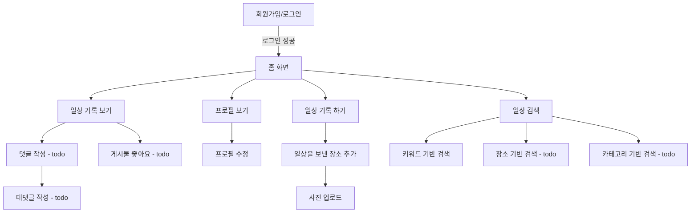

# 🚀 Beomstory

## 🎥 짧은 시연 영상 (예정)
> 📌 기능별 시연 영상 1  
> 📌 기능별 시연 영상 2

---

## ✔️ 프로젝트 개요

평소의 일상이나 여행 추억들을 기록해 추억하기 위함

### 🔗 링크
[🚀 서비스](https://beomstory-front-6ssnvg27t-qjatjr29s-projects.vercel.app)  
[🔗 프로젝트 노션 보기](https://www.notion.so/)  
[↖️ Front 코드 보러가기 (Github)](https://www.notion.so/)

### ⌛️ 프로젝트 기간
`2025.02 ~ ing`

---

## 🛠 프로젝트 구조

### 사용 기술
[](https://skillicons.dev)

#### 🌠 개발 언어 / 프레임워크


#### 📦 Database


#### 🧱 인프라


#### 📠 협업툴


### 🧱 ERD 


### ⭐️ 아키텍처


### 👤 유저 Flow


---

## 🏃프로젝트 진행

### ✅ 구현 필수 기능
- [x] 회원가입 / 로그인
- [x] 구글, 카카오 로그인
- [x] 프로필 조회 / 수정
- [x] 일상 기록 / 수정 / 삭제
- [x] 일상 기록 상세 조회 (모든 장소 조회)
- [x] 장소 생성 / 수정
- [x] 이미지 업로드 / 삭제
- [x] 기록 삭제시 기록에 포함된 모든 장소삭제(이미지 포함)
- [x] 키워드 기반 검색

--- 


## 🧑🏻‍💻 사용 기술 및 고려한 내용

### ⭐️ Kotlin

### 📦 Spring data R2dbc

### 🗳️ 트랜잭션 아웃박스 패턴 + kafka

### 🗂️ MySQL Full-Text Search


---

## 💥 트러블 슈팅

### 📨 코루틴 기반의 비동기 메시지 전송 방식
```
트랜잭션 아웃박스 패턴을 사용하여 outbox 테이블에서 배치 단위로 데이터를 가져와 Kafka로 메시지를 발행하여 데이터의 정합성을 맞추는 과정에서
메시지가 실제로 Kafka에 정상적으로 전달되었는지를 파악하고자 했습니다.
```

초기에는 _KafkaTemplate.send().get()_  를 통해 동기적으로 메시지가 정상적으로 전달되었는지 확인했습니다.

> 💣문제점
- 동기적 처리로 메시지당 응답을 기다려야 함
- 대량 메시지 처리 시 성능 저하
- Kafka의 비동기적 특성을 활용하지 못함
- 순차적 처리로 전체 소요 시간 증가

> **코루틴 기반의 비동기 메시지 전송 방식** 으로 해결  
> [해결 과정 - blog](https://beomsic.tistory.com/entry/%F0%9F%9A%90-Kafka-%EB%A9%94%EC%8B%9C%EC%A7%80-%EB%B0%9C%ED%96%89-%EC%B5%9C%EC%A0%81%ED%99%94-%EB%8F%99%EA%B8%B0-%EB%B0%A9%EC%8B%9D%EC%97%90%EC%84%9C-%EC%BD%94%EB%A3%A8%ED%8B%B4%EA%B9%8C%EC%A7%80%EC%9D%98-%EC%97%AC%EC%A0%95)


### 📂 Spring Data R2DBC - Coroutine 과 Pagination


### 🙈 Ubuntu 인스턴스 memory 부족


