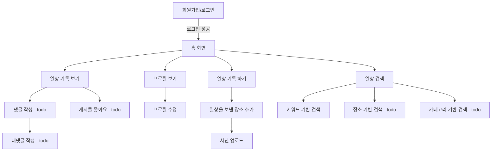

# 🚀 Beomstory

## 🎥 짧은 시연 영상 (예정)
> 📌 기능별 시연 영상 1  
> 📌 기능별 시연 영상 2

---

## ✔️ 프로젝트 개요

평소의 일상이나 여행 추억들을 기록해 추억하기 위함

### 🔗 링크
[🚀 서비스](https://beomstory-front-6ssnvg27t-qjatjr29s-projects.vercel.app)  
[🔗 프로젝트 노션 보기](https://www.notion.so/)  
[↖️ Front 코드 보러가기 (Github)](https://github.com/qjatjr29/beomstory-front)

### ⌛️ 프로젝트 기간
`2025.02 ~ ing`

---

## 🛠 프로젝트 구조

### 사용 기술
[](https://skillicons.dev)

#### 🌠 개발 언어 / 프레임워크


#### 📦 Database


#### 🧱 인프라


#### 📠 협업툴


### 🧱 ERD 


### ⭐️ 아키텍처


### 👤 유저 Flow


---

## 🏃프로젝트 진행

### ✅ 구현 필수 기능
- [x] 회원가입 / 로그인
- [x] 구글, 카카오 로그인
- [x] 프로필 조회 / 수정
- [x] 일상 기록 / 수정 / 삭제
- [x] 일상 기록 상세 조회 (모든 장소 조회)
- [x] 장소 생성 / 수정
- [x] 이미지 업로드 / 삭제
- [x] 기록 삭제시 기록에 포함된 모든 장소삭제(이미지 포함)
- [x] 키워드 기반 검색

--- 


## 🧑🏻‍💻 사용 기술 및 고려한 내용

### ⭐️ Kotlin

**✅ 사용 이유**

Java와 Spring Boot로 개발을 해왔지만 개인 프로젝트를 진행하면서 새로운 언어인 Kotlin을 경험해보고 싶었음.

Kotlin은 가독성과 널 처리 방식(Null Safety)이 뛰어나고 개발 생산성을 높여줄 수 있다고 판단하여 도입하게 됨.

**👍🏻 장점**

**Null Safety**
- Kotlin의 타입 시스템을 통해 NPE(NullPointerException) 가능성을 컴파일 타임에 예방.
- 명시적인 ?, ?:, !! 연산자 사용으로 코드 안정성을 높임.

**확장 함수**
- 기존 클래스에 기능을 추가할 수 있는 Kotlin 확장 함수를 적극 활용하여 코드 재사용성과 가독성을 높임.

**Data Class**
- 간결하게 DTO, Entity 정의를 위해 data class를 적극 활용
- equals/hashCode/toString 자동 생성의 이점을 활용.

---

### 📦 Spring data R2dbc
**✅ 사용 이유**  
Kotlin + Coroutine 환경에서 비동기 DB 통신이 필요해 R2DBC를 선택했습니다.
Hibernate Reactive도 검토했으나 코루틴과의 호환성 측면에서 R2DBC가 더 적합하다고 판단했습니다.

**👍🏻 장점**  
- Kotlin Coroutine 지원: suspend 함수 기반으로 자연스럽게 비동기 코드 작성 가능
- Spring 공식 지원: 트랜잭션 등 Spring 생태계와 연동이 쉬움

**⚠️ 한계**  
- ORM 기능 미지원: JPA 어노테이션 사용 불가, 엔티티 매핑 수동 처리 필요  
- 스키마 자동 생성 없음: 직접 SQL 스크립트나 마이그레이션 도구 사용

📝 예시
```kotlin
interface UserRepository : CoroutineCrudRepository<User, Long>
suspend fun findUserById(id: Long): User? = userRepository.findById(id)
```

> [blog 정리](https://beomsic.tistory.com/entry/Spring-data-R2DBC)

---

### 🗳️ 트랜잭션 아웃박스 패턴 + kafka

**✅ 사용 이유**  
- 데이터 정합성 보장: 일상(story) 삭제 시 연결된 장소(place) 삭제를 비동기적으로 처리하면서도 트랜잭션 안정성 확보

- 신뢰성: DB 트랜잭션과 Kafka 메시지 발행을 원자적(atomic) 으로 처리해 메시지 유실 방지

- 시스템 분리: 장소 삭제 처리를 이벤트 기반으로 분리해 서비스 간 결합도 감소

**🛠️ 구현 방법**  
1. 이벤트 저장 (story service)

```kotlin
@Transactional
suspend fun delete(userId: Long, storyId: Long) {
    storyDeletePort.deleteStory(userId, storyId)  // 1. 일상 삭제
    storyOutboxPort.saveStoryDeleteMessage(storyId) // 2. 아웃박스 테이블 저장
}
```

2. message 발행

```kotlin
@Scheduled(cron = "0 */10 * * * *")  // 10분 주기 실행
@Transactional
suspend fun publishPendingMessages() {
val pendingMessages = outboxRepository.findAllByOrderByCreatedAtAsc(batchSize)

    runBlocking {
        val successfulIds = publishPendingMessagesAsync(pendingMessages) // 3. Kafka 발행
        outboxRepository.deleteAllById(successfulIds)  // 4. 성공한 메시지 삭제
    }
}
```
3. consume 후 삭제 처리(place service)
```kotlin
@KafkaListener(topics = ["\${kafka.topic.story-outbox}"])
fun handleStoryOutboxEvent(payload: String) {
    runBlocking {
        try {
            val storyOutboxPayload = Json.decodeFromString<StoryOutboxPayload>(payload)
            when (storyOutboxPayload.type) {
                StoryOutboxType.STORY_DELETED -> handleStoryDeletedEvent(storyOutboxPayload.storyId)
            }
        } catch (e: Exception) {
            logger.error("❗ Kafka 메시지 처리 중 오류 발생: ${e.message}")
            throw e
        }
    }
}
```
---

### 🗂️ MySQL Full-Text Search

**🔍 배경 및 문제 상황**  
단순히 사용자들이 "제목" 또는 "설명"에 포함된 키워드로 `LIKE '%keyword%'` 검색을 수행하도록 설계했지만 이는 테이블 풀 스캔 방식으로 데이터가 많아질수록 성능이 좋지 않을 것이라 생각

**🛠️ 해결책: Full-Text Search + n-gram**

```sql
ALTER TABLE table_A ADD FULLTEXT INDEX idx_fulltext_title_desc (title, description);
```

```sql
EXPLAIN 
SELECT * FROM table_A WHERE MATCH(title, description) AGAINST('여행' IN BOOLEAN MODE);
```


> [blog 정리](https://beomsic.tistory.com/entry/MySQL-Full-Text-Search-%EB%8F%84%EC%9E%85%EA%B8%B0)

---

## 💥 트러블 슈팅

### 📨 코루틴 기반의 비동기 메시지 전송 방식
```
트랜잭션 아웃박스 패턴을 사용하여 outbox 테이블에서 배치 단위로 데이터를 가져와 Kafka로 메시지를 발행하여 데이터의 정합성을 맞추는 과정에서
메시지가 실제로 Kafka에 정상적으로 전달되었는지를 파악하고자 했습니다.
```

초기에는 _KafkaTemplate.send().get()_  를 통해 동기적으로 메시지가 정상적으로 전달되었는지 확인했습니다.

> 💣문제점
- 동기적 처리로 메시지당 응답을 기다려야 함
- 대량 메시지 처리 시 성능 저하
- Kafka의 비동기적 특성을 활용하지 못함
- 순차적 처리로 전체 소요 시간 증가

> **코루틴 기반의 비동기 메시지 전송 방식** 으로 해결  
> [해결 과정 - blog](https://beomsic.tistory.com/entry/%F0%9F%9A%90-Kafka-%EB%A9%94%EC%8B%9C%EC%A7%80-%EB%B0%9C%ED%96%89-%EC%B5%9C%EC%A0%81%ED%99%94-%EB%8F%99%EA%B8%B0-%EB%B0%A9%EC%8B%9D%EC%97%90%EC%84%9C-%EC%BD%94%EB%A3%A8%ED%8B%B4%EA%B9%8C%EC%A7%80%EC%9D%98-%EC%97%AC%EC%A0%95)

---

### 📂 Spring Data R2DBC - Coroutine 과 Pagination

**🔍 문제 상황**  
Spring Data R2DBC는 리액티브 특성상 Page/Slice 반환을 공식 지원 ❌
기존 JPA의 PagingAndSortingRepository처럼 자동화된 페이징이 불가능해 조회 + 총 개수 쿼리를 수동으로 결합
**🛠️ 해결 전략** 

커스텀 레포지토리 구현
- DatabaseClient를 이용해 LIMIT/OFFSET 기반 SQL 직접 작성

```kotlin
(예시)
val contentSql = """
    SELECT * FROM story
    WHERE title = :title
    LIMIT :limit OFFSET :offset
"""
val countSql = "SELECT COUNT(*) FROM story WHERE title = :title"
```

병렬 쿼리 실행
- 컨텐츠 조회와 총 개수 조회를 코루틴 병렬 처리
```kotlin
suspend fun paginate(...): Page<StoryEntity> {
    val content = contentQuery()
    val total = countQuery()
    return PageImpl(content, pageable, total)
}
```

**⚠️ 주의사항**  
- SQL 중복: 컨텐츠/개수 쿼리의 조건문이 동기화되지 않으면 데이터 불일치 발생
- 성능 저하: OFFSET 값이 클수록 쿼리 성능이 선형적으로 감소
- 트랜잭션 분리: 개수 쿼리와 컨텐츠 쿼리가 다른 스냅샷을 볼 수 있음


**🚀 최적화 방안(todo)**
1. 커서 기반 페이징 (고려)

```sql
WHERE id > :lastId ORDER BY id LIMIT :size
```
- OFFSET 대신 ID 범위 조건 사용


2. R2dbcEntityTemplate 활용

```kotlin
template.select(StoryEntity::class)
    .matching(Query.query(where("title").`is`(title)).with(pageable))
    .all()
```

3. 캐시 전략

```kotlin
@Cacheable("storyCount")
suspend fun getTotalCount(): Long
```
- 개수 정보에 대해 캐싱으로 조회 성능이 향상될 것이라 예상


